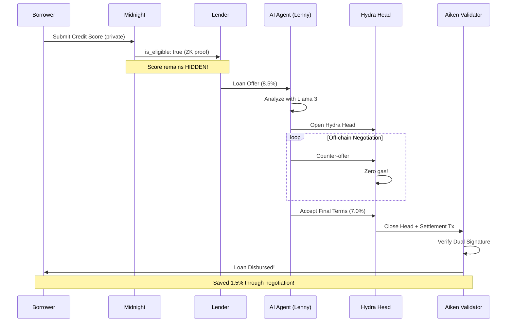

# Lendora AI

> **Privacy-First DeFi Lending on Cardano 2025**

Lendora is a next-generation decentralized lending protocol where AI agents negotiate loans in private **Hydra Heads** (zero gas fees), using **Midnight ZK-Proofs** for credit scoring, with a stunning **3D immersive dashboard**.

---

## Live Demo

```bash
# Start Backend
cd backend/api && uvicorn server:app --port 8000

# Start Frontend  
cd frontend/Dashboard && npm run dev

# Open: http://localhost:8080/dashboard
```

---

## Architecture



---

## The Problem & Solution

| Problem | Lendora's Solution |
|---------|-------------------|
| **Gas Fees** - Every negotiation costs money | **Hydra Heads** - Unlimited off-chain rounds, zero gas |
| **Privacy Leaks** - Credit scores on-chain | **Midnight ZK** - Prove eligibility without revealing score |
| **Black Box AI** - Users don't understand decisions | **XAI Logging** - Every decision explained with reasoning |
| **Centralized AI** - Data sent to OpenAI | **Local Llama 3** - All AI runs on your machine via Ollama |

---

## Tech Stack

### Backend (Cardano 2025)

| Layer | Technology | Purpose |
|-------|-----------|---------|
| **AI Agents** | CrewAI + Llama 3 (Ollama) | Privacy-first loan negotiation |
| **L2 Scaling** | Hydra Head Protocol | Off-chain, zero-gas negotiation |
| **Settlement** | Aiken Smart Contracts | On-chain loan escrow & dual-sig verification |
| **Privacy** | Midnight Compact | Zero-knowledge credit scoring |
| **API** | FastAPI + WebSockets | Real-time backend communication |

### Frontend (Immersive 3D)

| Component | Technology | Purpose |
|-----------|-----------|---------|
| **3D Engine** | React Three Fiber + Drei | WebGL 3D interface |
| **Animations** | Framer Motion | Scroll-linked transforms |
| **UI** | React + TypeScript + Vite | Type-safe, fast builds |
| **Styling** | Tailwind CSS | Glassmorphism & themes |
| **State** | React Query + WebSocket | Real-time updates |

---

## Features

### Complete Workflow (All Working!)

1. **Midnight ZK Credit Check** - Submit credit score privately, get public eligibility
2. **Loan Offer Creation** - Lender creates offer with terms
3. **Hydra Head Opening** - Private negotiation channel (L2)
4. **AI Analysis** - Llama 3 analyzes offer locally
5. **Off-chain Negotiation** - Multiple rounds, zero gas fees
6. **Aiken Settlement** - On-chain verification with dual signatures
7. **Loan Disbursement** - Funds released to borrower

### AI Agents

- **Lenny (Borrower Agent)** - Analyzes offers, negotiates best rates
- **Luna (Lender Agent)** - Assesses risk, evaluates counter-offers
- **XAI Logging** - All decisions logged with reasoning & confidence

### Frontend Dashboard

- **3D Login Portal** - Holographic cube with particle field
- **Wallet Connection** - Eternl, Nami, and other CIP-30 wallets
- **Role Selection** - Choose to be Borrower or Lender
- **Stablecoin Selection** - USDT, USDC, DAI with liquidity suggestions
- **Auto-Confirm Toggle** - Let AI auto-accept good deals
- **Agent Conversations** - Real-time negotiation chat between agents
- **AI Thoughts** - View Masumi's reasoning and confidence scores
- **Agent Status Orb** - Real-time 3D sphere (green=profiting, blue=negotiating)
- **Workflow Visualizer** - Live step-by-step progress
- **Trade History** - Completed loans with savings shown
- **Dual Themes** - Cyber-Noir (dark) / Foggy Future (light)

---

## Quick Start

### Prerequisites

```bash
# 1. Ollama (for local Llama 3)
curl -fsSL https://ollama.com/install.sh | sh
ollama pull llama3
ollama serve  # Keep running

# 2. Node.js 18+
node --version  # Should be 18+

# 3. Python 3.10+
python --version  # Should be 3.10+
```

### Installation

```bash
# Clone
git clone https://github.com/your-repo/Lendora-AI.git
cd Lendora-AI

# Backend dependencies
pip install -r requirements.txt
pip install -r backend/api/requirements.txt

# Frontend dependencies
cd frontend/Dashboard
npm install
cd ../..
```

### Running

**Terminal 1 - Backend:**
```bash
cd backend/api
uvicorn server:app --host 0.0.0.0 --port 8000
```

**Terminal 2 - Frontend:**
```bash
cd frontend/Dashboard
npm run dev
```

**Terminal 3 - AI Agent (Optional):**
```bash
python agents/borrower_agent.py
```

### URLs

| Service | URL |
|---------|-----|
| Frontend Login | http://localhost:8080 |
| Frontend Dashboard | http://localhost:8080/dashboard |
| Backend API | http://localhost:8000 |
| API Documentation | http://localhost:8000/docs |
| Ollama | http://localhost:11434 |

### First Time Setup

1. **Install Eternl Wallet:**
   - Go to [eternl.io](https://eternl.io) and install the browser extension
   - Create or import a wallet
   - Make sure it's unlocked

2. **Start Services:**
   ```bash
   # Terminal 1: Backend
   cd backend/api
   uvicorn server:app --port 8000
   
   # Terminal 2: Frontend
   cd frontend/Dashboard
   npm run dev
   
   # Terminal 3: Ollama (if not already running)
   ollama serve
   ```

3. **Connect Wallet:**
   - Open http://localhost:8080
   - Click "Connect Wallet"
   - Select "Eternl" from the list
   - Approve the connection in the Eternl popup
   - You'll be redirected to the dashboard

4. **Start Your First Loan:**
   - Select your role (Borrower or Lender)
   - Choose a stablecoin (USDT recommended)
   - Enter loan parameters
   - Click "Start Loan Request" or "Start Lending"
   - Watch the AI agents negotiate in real-time!

---

## API Endpoints

### Start Complete Workflow

```bash
POST /api/workflow/start
Content-Type: application/json

{
  "borrower_address": "addr1_borrower_alice",
  "credit_score": 750,
  "principal": 1000,
  "interest_rate": 8.5,
  "term_months": 12,
  "lender_address": "addr1_lender_bob"
}

# Response
{
  "success": true,
  "settlement": {
    "tx_hash": "tx_head_...",
    "borrower": "addr1_borrower_alice",
    "lender": "addr1_lender_bob",
    "principal": 1000,
    "final_rate": 7.0,
    "status": "LOAN_DISBURSED"
  }
}
```

### Other Endpoints

| Endpoint | Method | Description |
|----------|--------|-------------|
| `/api/dashboard/stats` | GET | Dashboard statistics |
| `/api/trades/history` | GET | Recent trade history |
| `/api/agent/status` | GET | AI agent status |
| `/api/agent/xai-logs` | GET | Explainable AI decision logs |
| `/api/midnight/credit-check` | POST | ZK credit verification |
| `/ws` | WebSocket | Real-time updates |

---

## Project Structure

```
Lendora-AI/
├── agents/                      # AI Agents
│   ├── borrower_agent.py       # Lenny - Borrower negotiator
│   ├── lender_agent.py         # Luna - Lender evaluator
│   └── __init__.py
├── backend/
│   └── api/
│       ├── server.py           # FastAPI + WebSocket server
│       └── requirements.txt
├── contracts/
│   └── contracts/
│       └── validators/
│           └── lendora.ak      # Aiken settlement validator
├── frontend/
│   └── Dashboard/
│       ├── src/
│       │   ├── components/
│       │   │   ├── 3d/         # HeroCube, ParticleField, AgentStatusOrb
│       │   │   ├── dashboard/  # TradeTimeline, StatCard
│       │   │   └── ui/         # shadcn/ui components
│       │   ├── hooks/
│       │   │   ├── useWallet.ts    # Cardano wallet connection
│       │   │   └── useAgentConnection.ts
│       │   ├── lib/
│       │   │   ├── api/        # REST client
│       │   │   └── wallet/     # CIP-30 wallet integration
│       │   └── pages/
│       │       ├── LoginGate.tsx
│       │       └── DashboardLayout.tsx
│       └── package.json
├── hydra/
│   └── head_manager.py         # Hydra WebSocket client
├── midnight/
│   └── credit_score.compact    # ZK credit check circuit
├── logs/
│   └── xai_decisions.jsonl     # AI decision audit trail
└── README.md
```

---

## Smart Contracts

### Aiken Settlement Validator

```aiken
validator {
  fn settle(
    datum: LoanDatum,
    redeemer: SettleLoan,
    context: ScriptContext,
  ) -> Bool {
    // 1. Interest rate must be reasonable (0-100%)
    let interest_rate_valid = 
      redeemer.final_interest_rate >= 0 && 
      redeemer.final_interest_rate <= 10000
    
    // 2. Both parties must sign
    let signed_by_borrower = 
      list.has(transaction.extra_signatories, datum.borrower)
    let signed_by_lender = 
      list.has(transaction.extra_signatories, datum.lender)
    
    interest_rate_valid && signed_by_borrower && signed_by_lender
  }
}
```

### Midnight ZK Credit Check

```compact
circuit check_eligibility(
    private credit_score: Uint
) -> (public is_eligible: Boolean) {
    const MIN_CREDIT_SCORE: Uint = 700;
    is_eligible = credit_score > MIN_CREDIT_SCORE;
    return (is_eligible);
}
```

---

## Explainable AI (XAI)

Every AI decision is logged to `logs/xai_decisions.jsonl`:

```json
{
  "timestamp": 1732872000,
  "agent": "lenny",
  "decision": "accept_loan",
  "reasoning": "Rate of 7.0% is below market average of 7.5%. Negotiated down from 8.5%, saving 1.5%.",
  "confidence": 0.85
}
```

This solves the "black box" problem - users can audit every AI decision.

---

## Wallet Integration

### Supported Wallets

Lendora AI supports all CIP-30 compatible Cardano wallets:

- **Eternl** (Recommended) - Most feature-rich, best compatibility
- **Nami** - Popular and user-friendly
- **Yoroi** - Lightweight browser extension
- **Flint** - Modern wallet with great UX
- **Typhon** - Advanced features
- **Gero** - Multi-chain support

### How to Connect Your Wallet

#### Step 1: Install Eternl Wallet (Recommended)

1. **Chrome/Edge/Brave:**
   - Visit [Eternl.io](https://eternl.io)
   - Click "Download" → "Chrome Extension"
   - Click "Add to Chrome" and confirm installation

2. **Firefox:**
   - Visit [Eternl.io](https://eternl.io)
   - Click "Download" → "Firefox Extension"
   - Click "Add to Firefox" and confirm installation

3. **After Installation:**
   - Click the Eternl extension icon in your browser toolbar
   - Create a new wallet or import an existing one
   - **Important:** Make sure the wallet is unlocked before connecting

#### Step 2: Connect to Lendora AI

1. **Start the Application:**
   ```bash
   # Terminal 1 - Backend
   cd backend/api
   uvicorn server:app --port 8000
   
   # Terminal 2 - Frontend
   cd frontend/Dashboard
   npm run dev
   ```

2. **Open the Login Page:**
   - Navigate to `http://localhost:8080` (or the port shown in terminal)
   - You'll see the 3D login portal with particle effects

3. **Connect Your Wallet:**
   - Click the **"Connect Wallet"** button
   - A dropdown will appear showing available wallets
   - **Eternl** should appear first with a "Recommended" badge if installed
   - Click on **"Eternl"** (or your preferred wallet)

4. **Approve Connection:**
   - Eternl will show a connection popup
   - Review the connection request
   - Click **"Approve"** or **"Connect"** in the Eternl popup
   - The page will automatically navigate to the dashboard

5. **Verify Connection:**
   - On the dashboard, you should see:
     - Your wallet address (shortened format)
     - Your ADA balance
     - Network (Mainnet/Testnet)
   - The wallet connection card should show "Connected"

#### Step 3: Using Manual Address Entry (Optional)

If you prefer not to connect a wallet extension:

1. On the login page, click **"Connect Wallet"**
2. Click the edit icon next to **"Or Enter Address Manually"**
3. Paste your Cardano address (starts with `addr1...`)
4. Click **"Start Loan Request"** or **"Start Lending"**

**Note:** Manual address entry works for viewing and testing, but you won't be able to sign transactions.

### Troubleshooting Wallet Connection

#### Issue: "Eternl wallet not found"

**Solutions:**
1. **Refresh the page** after installing Eternl
2. **Unlock your Eternl wallet** - Make sure it's not locked
3. **Check browser permissions** - Ensure extensions are enabled
4. **Try a different browser** - Some browsers have better extension support
5. **Check console logs** - Open browser DevTools (F12) → Console tab for detailed errors

#### Issue: "Connection rejected by user"

**Solution:**
- You clicked "Reject" in the wallet popup. Try connecting again and click "Approve"

#### Issue: "Connection timeout"

**Solutions:**
1. Make sure Eternl is unlocked
2. Close and reopen the Eternl extension
3. Try refreshing the page
4. Check if other Cardano dApps can connect (to verify Eternl is working)

#### Issue: Wallet not appearing in list

**Solutions:**
1. **Refresh the page** - Wallets are detected on page load
2. **Check if extension is enabled** - Go to browser extensions settings
3. **Try manual address entry** as a workaround

### Wallet Features in Lendora

Once connected, you can:

- **View Balance** - See your ADA balance in real-time
- **Select Role** - Choose to be a Borrower or Lender
- **Start Workflows** - Initiate loan requests or lending
- **Track Transactions** - See all your loan activities
- **Auto-Confirm** - Enable AI to auto-accept good deals (optional)

### Security Best Practices

1. **Never share your seed phrase** - Lendora never asks for it
2. **Verify connection requests** - Always check what permissions you're granting
3. **Use Testnet for testing** - Switch to Testnet in Eternl before testing
4. **Review transactions** - Always review before signing
5. **Keep wallet updated** - Update Eternl regularly for security patches

### Code Example

```typescript
import { useWallet } from '@/hooks/useWallet';

const { 
    connect, 
    isConnected, 
    address, 
    balance, 
    network,
    disconnect 
} = useWallet();

// Connect to Eternl
await connect('eternl');

// Check connection status
if (isConnected) {
    console.log(`Connected: ${address}`);
    console.log(`Balance: ${balance} ADA`);
    console.log(`Network: ${network}`);
}

// Disconnect
disconnect();
```

---

## Current Status

### Implemented

- [x] Complete workflow (Midnight -> Hydra -> Aiken)
- [x] AI Agent with local Llama 3 (CrewAI + Ollama) - Lazy loading (no auto-start)
- [x] Lender Agent counterpart (Luna)
- [x] Hydra Head Manager (real node support + mock fallback)
- [x] Aiken settlement validator with tests
- [x] Midnight ZK credit check circuit
- [x] XAI decision logging
- [x] FastAPI REST + WebSocket server
- [x] 3D immersive dashboard
- [x] Real-time workflow visualization
- [x] Wallet connection (CIP-30) - Eternl optimized
- [x] Role selection (Borrower/Lender)
- [x] Stablecoin selection with suggestions
- [x] Auto-confirm toggle for autonomous deals
- [x] Agent conversation viewer
- [x] AI thought process display (XAI)
- [x] Mobile-optimized particles
- [x] Dual themes (Cyber-Noir / Foggy Future)
- [x] Manual address entry option

### Future Enhancements

- [ ] Connect to actual Hydra node
- [ ] Actual Midnight network integration
- [ ] Real Cardano tx building (PyCardano)
- [ ] Holographic 3D analytics charts
- [ ] Oracle integration for credit scores
- [ ] Multi-agent negotiation scenarios

---

## Development

### Run Tests

```bash
# Aiken contracts
cd contracts/contracts
aiken check

# Python syntax
python -m py_compile agents/*.py backend/api/server.py

# Frontend build
cd frontend/Dashboard
npm run build
```

### Environment Variables

Create `.env` in project root:

```env
OLLAMA_BASE_URL=http://localhost:11434
HYDRA_NODE_URL=ws://localhost:4001
VITE_API_URL=http://localhost:8000
```

---

## Resources

### Cardano Stack
- [Hydra Documentation](https://hydra.family/head-protocol/docs/)
- [Aiken Language Guide](https://aiken-lang.org/)
- [Midnight Developer Portal](https://midnight.network/)

### AI/ML
- [CrewAI Documentation](https://docs.crewai.com/)
- [Ollama](https://ollama.com/)
- [LiteLLM](https://docs.litellm.ai/)

### Frontend
- [React Three Fiber](https://docs.pmnd.rs/react-three-fiber/)
- [Drei (R3F Helpers)](https://github.com/pmndrs/drei)
- [Framer Motion](https://www.framer.com/motion/)
- [shadcn/ui](https://ui.shadcn.com/)

---

## Disclaimer

This is **educational/experimental software** for the Cardano 2025 hackathon. Do not use in production without:

- Security audits
- Real credit score oracles
- Legal compliance review
- Extensive testing

---

## License

MIT License - Build cool things!

---

**Built for the Cardano 2025 Hackathon**

*Privacy-First DeFi Lending with AI Agents, ZK Proofs, and L2 Scaling*
