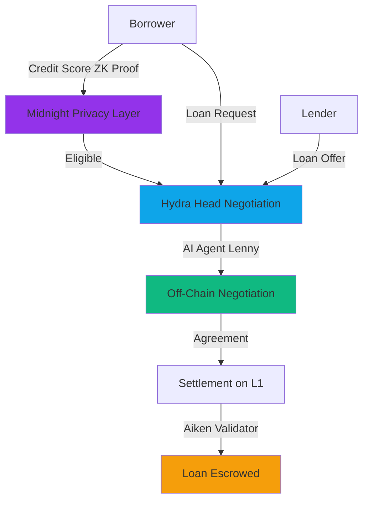
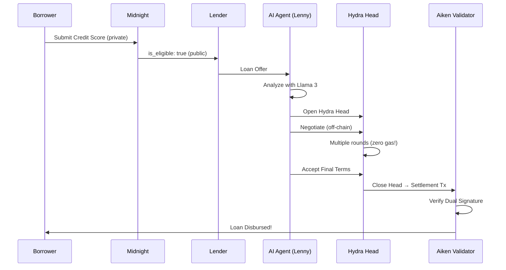

# 🚀 Lendora AI

> **Privacy-First DeFi Lending on Cardano 2025**

Lendora is a decentralized lending protocol where AI agents negotiate loans in private **Hydra Heads** to avoid gas fees, using **Midnight ZK-Proofs** for credit scoring.

---

## 🎯 The Vision

Traditional DeFi lending has three major problems:

1. **Gas Fees** - Every negotiation step costs money
2. **Privacy Leaks** - Credit scores are public on-chain
3. **Black Box AI** - Users don't understand AI decisions

### Lendora's Solution



---

## 🏗️ Architecture

### The Cardano 2025 Stack

| Layer | Technology | Purpose |
|-------|-----------|---------|
| **AI Agents** | Masumi (CrewAI + Llama 3) | Privacy-first loan negotiation |
| **Scaling** | Hydra Head Protocol | Off-chain, zero-gas-fee negotiation |
| **Settlement** | Aiken Smart Contracts | On-chain loan escrow & verification |
| **Privacy** | Midnight Compact | Zero-knowledge credit scoring |

---

## 📁 Project Structure

```
lendora-ai/
├── agents/                  # AI Agents (Python)
│   ├── borrower_agent.py   # "Lenny" - The negotiator
│   └── __init__.py
├── hydra/                   # Hydra Head Integration
│   ├── head_manager.py     # WebSocket client for Hydra node
│   └── __init__.py
├── contracts/               # Aiken Smart Contracts
│   └── validators/
│       └── lendora.ak      # Settlement validator
├── midnight/                # Privacy Layer
│   └── credit_score.compact # ZK credit check
├── logs/                    # XAI decision logs
├── requirements.txt         # Python dependencies
└── README.md               # You are here!
```

---

## 🛠️ Setup

### Prerequisites

1. **Ollama** (for local Llama 3)
   ```bash
   # Install Ollama
   curl -fsSL https://ollama.com/install.sh | sh
   
   # Pull Llama 3
   ollama pull llama3
   
   # Start Ollama server
   ollama serve
   ```

2. **Hydra Node** (for state channels)
   ```bash
   # Follow the official guide:
   # https://hydra.family/head-protocol/docs/getting-started
   
   # The Python code expects a node at: ws://localhost:4001
   ```

3. **Aiken** (for smart contracts)
   ```bash
   # Install Aiken
   cargo install aiken
   
   # Check installation
   aiken --version
   ```

4. **Python 3.10+**
   ```bash
   # Create virtual environment
   python -m venv venv
   source venv/bin/activate  # On Windows: venv\Scripts\activate
   
   # Install dependencies
   pip install -r requirements.txt
   ```

### Quick Start

1. **Clone the repository**
   ```bash
   git clone <your-repo>
   cd lendora-ai
   ```

2. **Set up Python environment**
   ```bash
   python -m venv venv
   source venv/bin/activate
   pip install -r requirements.txt
   ```

3. **Run the Borrower Agent**
   ```bash
   python agents/borrower_agent.py
   ```

4. **Compile Aiken Contracts**
   ```bash
   cd contracts
   aiken build
   ```

---

## 🤖 The AI Agent: "Lenny"

### Privacy-First Configuration

Lendora uses **Llama 3** running locally via **Ollama**. No data leaves your machine.

```python
# From agents/borrower_agent.py
llama3_llm = ChatOpenAI(
    model="llama3",
    base_url="http://localhost:11434/v1",  # Local Ollama
    api_key="NA",  # Not needed for local
    temperature=0.7,
)
```

### Custom Tools

1. **HydraTool** - Opens Hydra Heads for off-chain negotiation
2. **XAITool** - Logs decisions for transparency (solves "black box" problem)

### Example Flow

```python
from agents import monitor_loan_offers

# Lenny listens for loan offers
monitor_loan_offers()

# When an offer arrives:
# 1. Lenny analyzes it using Llama 3
# 2. If acceptable, opens a Hydra Head (HydraTool)
# 3. Logs reasoning (XAITool) → xai_decisions.jsonl
```

---

## ⚡ Hydra Head Integration

### The `HydraClient` Class

```python
from hydra import HydraClient

client = HydraClient()

# 1. Initialize Head with participants
client.init_head(['participant1', 'participant2'])

# 2. Commit funds
client.commit_funds('abc123...#0')

# 3. Negotiate off-chain (no gas fees!)
client.new_tx('84a400...')  # CBOR transaction

# 4. Close and settle on L1
client.close_head()
```

### Why Hydra?

- ⚡ **Instant finality** - No waiting for blocks
- 💰 **Zero gas fees** - Negotiate for free
- 🔒 **Private** - Only participants see the state

---

## 🔐 Privacy Layer: Midnight

### Zero-Knowledge Credit Scoring

The `credit_score.compact` contract lets borrowers prove creditworthiness **without revealing their score**.

```compact
circuit check_eligibility(
    private credit_score: Uint
) -> (public is_eligible: Boolean) {
    const MIN_CREDIT_SCORE: Uint = 700;
    is_eligible = credit_score > MIN_CREDIT_SCORE;
    return (is_eligible);
}
```

**What the lender sees:**
- ✅ `is_eligible: true`
- ❌ `credit_score: <HIDDEN>`

**Zero-knowledge magic!** 🎩

---

## 🎯 Smart Contract: Settlement Validator

The `lendora.ak` Aiken validator ensures:

1. ✅ Both borrower and lender have signed
2. ✅ Interest rate is reasonable (0-100%)

```aiken
validator {
  fn settle(
    datum: LoanDatum,
    redeemer: SettleLoan,
    context: ScriptContext,
  ) -> Bool {
    // Dual signature check
    signed_by_borrower && signed_by_lender && valid_interest_rate
  }
}
```

### Testing

```bash
cd contracts
aiken check
```

---

## 📊 Explainable AI (XAI)

Every decision Lenny makes is logged to `logs/xai_decisions.jsonl`:

```json
{
  "timestamp": 1732872000,
  "decision": "accept_loan",
  "reasoning": "Interest rate of 7.5% is favorable...",
  "confidence": 0.85
}
```

This solves the "black box" problem in AI-driven DeFi.

---

## 🔄 Full Workflow



---

## 🚧 Current Status

### ✅ Implemented
- [x] AI agent with local Llama 3
- [x] Hydra WebSocket client
- [x] Aiken settlement validator
- [x] Midnight ZK credit check (mock)
- [x] XAI decision logging

### 🚧 TODO
- [ ] Actual Midnight network integration
- [ ] Real Cardano transaction building (PyCardano)
- [ ] Lender agent counterpart
- [ ] Web dashboard for monitoring
- [ ] Oracle integration for credit scores

---

## 🤝 Contributing

This is a demonstration project showcasing the Cardano 2025 stack. Feel free to:

1. Fork and experiment
2. Build additional agents (e.g., Lender Agent)
3. Improve the Hydra integration
4. Add real Cardano transaction logic

---

## 📚 Resources

- [Hydra Documentation](https://hydra.family/head-protocol/docs/)
- [Aiken Language Guide](https://aiken-lang.org/)
- [Midnight Developer Portal](https://midnight.network/)
- [CrewAI Documentation](https://docs.crewai.com/)
- [Ollama](https://ollama.com/)

---

## ⚠️ Disclaimer

This is **educational/experimental software**. Do not use in production without:
- Proper security audits
- Real credit score oracles
- Legal compliance review
- Extensive testing

---

## 📄 License

MIT License - Build cool things! 🚀

---

**Built with ❤️ for the Cardano 2025 hackathon**
