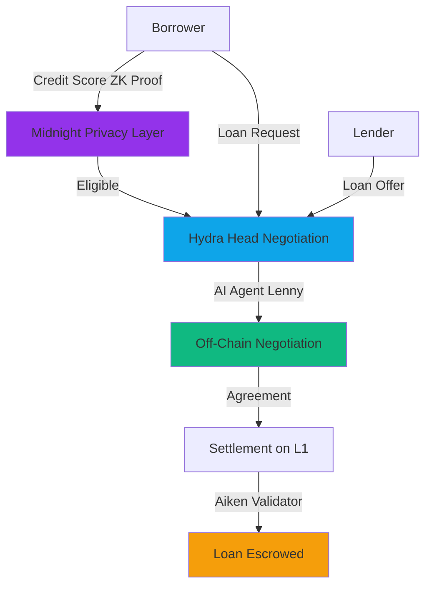
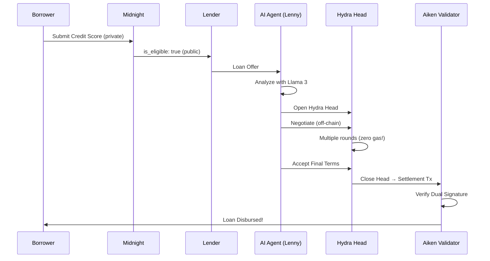

# Lendora AI

> **Privacy-First DeFi Lending on Cardano 2025 with Immersive 3D Interface**

Lendora is a next-generation decentralized lending protocol where AI agents negotiate loans in private **Hydra Heads** to avoid gas fees, using **Midnight ZK-Proofs** for credit scoring, presented through a stunning **3D immersive dashboard**.

---

## The Vision

Traditional DeFi lending has three major problems:

1. **Gas Fees** - Every negotiation step costs money
2. **Privacy Leaks** - Credit scores are public on-chain
3. **Black Box AI** - Users don't understand AI decisions

### Lendora's Solution



---

## Full Stack Architecture

### Backend: The Cardano 2025 Stack

| Layer | Technology | Purpose |
|-------|-----------|---------|
| **AI Agents** | Masumi (CrewAI + Llama 3) | Privacy-first loan negotiation |
| **Scaling** | Hydra Head Protocol | Off-chain, zero-gas-fee negotiation |
| **Settlement** | Aiken Smart Contracts | On-chain loan escrow & verification |
| **Privacy** | Midnight Compact | Zero-knowledge credit scoring |
| **API** | FastAPI + WebSockets | Real-time backend communication |

### Frontend: Kasane-Cosmos Aesthetic

| Component | Technology | Purpose |
|-----------|-----------|---------|
| **3D Engine** | React Three Fiber + Drei | Immersive 3D interface |
| **Animations** | Framer Motion | Scroll-linked 3D transforms |
| **UI Framework** | React + TypeScript + Vite | Fast, type-safe development |
| **Styling** | Tailwind CSS | Glassmorphism & custom palettes |
| **Theme** | next-themes | Dark/Light mode (Cyber-Noir/Foggy Future) |

---

## Features

### Backend
- **Privacy-First AI**: Llama 3 runs locally via Ollama - no data leaves your machine
- **Zero Gas Negotiations**: Unlimited negotiation rounds in Hydra Heads
- **ZK Credit Scoring**: Prove creditworthiness without revealing your score
- **Explainable AI**: Every decision logged with reasoning (XAI)
- **Real-Time Updates**: WebSocket support for live agent status

### Frontend
- **3D Portal Login**: Rotating holographic cube with particle field background
- **Floating Dashboards**: Glassmorphic Bento grid cards with liquid distortion
- **Kasane Scroll Effect**: Trade cards tilt in 3D space as you scroll
- **Agent Status Orb**: Pulsing 3D sphere showing real-time AI status
- **Camera Transitions**: Cinematic zoom animations between views
- **Dual Themes**: Cyber-Noir (dark) and Foggy Future (light) palettes

---

## Quick Start

See [QUICKSTART.md](./QUICKSTART.md) for detailed instructions.

### 1. Backend API Server

```bash
cd backend/api
pip install -r requirements.txt
python server.py
```

Server runs at:
- REST API: `http://localhost:8000`
- WebSocket: `ws://localhost:8000/ws`
- API Docs: `http://localhost:8000/docs`

### 2. Frontend Dashboard

```bash
cd frontend/Dashboard
npm install
npm run dev
```

Dashboard runs at: `http://localhost:5173`

### 3. AI Agent (Optional)

```bash
# Ensure Ollama is running first
ollama serve

# Run the Masumi agent
python agents/borrower_agent.py
```

---

## Project Structure

```
lendora-ai/
├── agents/                          # AI Agents (Python)
│   ├── borrower_agent.py           # "Lenny" - The Masumi negotiator
│   └── __init__.py
├── backend/
│   └── api/
│       ├── server.py                # FastAPI + WebSocket server
│       └── requirements.txt
├── contracts/                       # Aiken Smart Contracts
│   └── validators/
│       └── lendora.ak              # Settlement validator
├── frontend/
│   └── Dashboard/                   # Immersive 3D Dashboard
│       ├── src/
│       │   ├── components/
│       │   │   ├── 3d/             # HeroCube, ParticleField, AgentStatusOrb
│       │   │   └── dashboard/      # TradeTimeline with Kasane scroll
│       │   ├── lib/api/            # API client & WebSocket manager
│       │   ├── pages/              # LoginGate, DashboardLayout
│       │   └── App.tsx
│       ├── tailwind.config.ts      # Kasane-Cosmos color palettes
│       └── package.json
├── hydra/                           # Hydra Head Integration
│   ├── head_manager.py             # WebSocket client for Hydra node
│   └── __init__.py
├── midnight/                        # Privacy Layer
│   └── credit_score.compact        # ZK credit check
├── logs/                            # XAI decision logs
├── QUICKSTART.md                    # Quick setup guide
├── requirements.txt                 # Python dependencies
└── README.md                        # You are here!
```

---

## UI Screenshots & Design

### Login Portal
- **3D HeroCube** - Rotating holographic cube (glass in light mode, neon wireframe in dark mode)
- **Particle Field** - 5000 WebGL particles react to mouse movement
- **Camera Zoom** - Portal entrance animation on wallet connect

### Dashboard Cockpit
- **Bento Grid Layout** - Floating glassmorphic cards
- **Agent Status Orb** - 3D pulsing sphere (green = profiting, amber = negotiating)
- **CountUp Animations** - Balance animates to final value
- **Liquid Distortion** - Cards morph on hover

### Trade Timeline
- **Kasane Scroll Effect** - Cards tilt backward and blur as you scroll
- **3D Depth** - Parallax layers create spatial depth
- **Real-Time Updates** - WebSocket-powered live trade notifications

---

## Prerequisites

### 1. Ollama (for local Llama 3)
```bash
# Install Ollama
curl -fsSL https://ollama.com/install.sh | sh

# Pull Llama 3
ollama pull llama3

# Start Ollama server
ollama serve
```

### 2. Node.js 18+ (for frontend)
```bash
# Check version
node --version
npm --version
```

### 3. Python 3.10+ (for backend)
```bash
# Create virtual environment
python -m venv venv
source venv/bin/activate  # On Windows: venv\Scripts\activate
```

### 4. Aiken (for smart contracts - OPTIONAL)
```bash
# Install Aiken
cargo install aiken

# Check installation
aiken --version
```

### 5. Hydra Node (for state channels - OPTIONAL)
```bash
# Follow the official guide:
# https://hydra.family/head-protocol/docs/getting-started

# The Python code expects a node at: ws://localhost:4001
```

---

## The AI Agent: "Lenny"

### Privacy-First Configuration

Lendora uses **Llama 3** running locally via **Ollama**. No data leaves your machine.

```python
# From agents/borrower_agent.py
llama3_llm = ChatOpenAI(
    model="llama3",
    base_url="http://localhost:11434/v1",  # Local Ollama
    api_key="NA",  # Not needed for local
    temperature=0.7,
)
```

**Privacy Verified**: No OpenAI GPT-4 - All AI processing happens locally.

### Custom Tools

1. **HydraTool** - Opens Hydra Heads for off-chain negotiation
2. **XAITool** - Logs decisions for transparency (solves "black box" problem)

### Example Flow

```python
from agents import monitor_loan_offers

# Lenny listens for loan offers
monitor_loan_offers()

# When an offer arrives:
# 1. Lenny analyzes it using Llama 3
# 2. If acceptable, opens a Hydra Head (HydraTool)
# 3. Logs reasoning (XAITool) → xai_decisions.jsonl
```

---

## Hydra Head Integration

### The `HydraClient` Class

```python
from hydra import HydraClient

client = HydraClient()

# 1. Initialize Head with participants
client.init_head(['participant1', 'participant2'])

# 2. Commit funds
client.commit_funds('abc123...#0')

# 3. Negotiate off-chain (no gas fees!)
client.new_tx('84a400...')  # CBOR transaction

# 4. Close and settle on L1
client.close_head()
```

### Why Hydra?

- **Instant finality** - No waiting for blocks
- **Zero gas fees** - Negotiate for free
- **Private** - Only participants see the state

---

## Privacy Layer: Midnight

### Zero-Knowledge Credit Scoring

The `credit_score.compact` contract lets borrowers prove creditworthiness **without revealing their score**.

```compact
circuit check_eligibility(
    private credit_score: Uint
) -> (public is_eligible: Boolean) {
    const MIN_CREDIT_SCORE: Uint = 700;
    is_eligible = credit_score > MIN_CREDIT_SCORE;
    return (is_eligible);
}
```

**What the lender sees:**
- `is_eligible: true`
- `credit_score: <HIDDEN>`

**Zero-knowledge magic!**

---

## Smart Contract: Settlement Validator

The `lendora.ak` Aiken validator ensures:

1. Both borrower and lender have signed
2. Interest rate is reasonable (0-100%)

```aiken
validator {
  fn settle(
    datum: LoanDatum,
    redeemer: SettleLoan,
    context: ScriptContext,
  ) -> Bool {
    // Dual signature check
    signed_by_borrower && signed_by_lender && valid_interest_rate
  }
}
```

### Testing

```bash
cd contracts
aiken check
```

---

## Explainable AI (XAI)

Every decision Lenny makes is logged to `logs/xai_decisions.jsonl`:

```json
{
  "timestamp": 1732872000,
  "decision": "accept_loan",
  "reasoning": "Interest rate of 7.5% is favorable...",
  "confidence": 0.85
}
```

This solves the "black box" problem in AI-driven DeFi.

---

## Full Workflow



---

## Current Status

### Backend Implemented
- [x] AI agent with local Llama 3
- [x] Hydra WebSocket client
- [x] Aiken settlement validator with tests
- [x] Midnight ZK credit check (syntactically correct)
- [x] XAI decision logging
- [x] FastAPI REST API server
- [x] WebSocket real-time updates

### Frontend Implemented
- [x] 3D immersive login portal (HeroCube + ParticleField)
- [x] Floating glassmorphic dashboard (Bento grid)
- [x] Agent Status Orb (3D pulsing sphere)
- [x] Kasane scroll effect (3D trade timeline)
- [x] Cyber-Noir/Foggy Future dual themes
- [x] API client with WebSocket integration
- [x] CountUp animations and liquid distortion effects

### Future Enhancements
- [ ] Connect to actual Hydra node (currently mocked)
- [ ] Actual Midnight network integration
- [ ] Real Cardano transaction building (PyCardano)
- [ ] Lender agent counterpart
- [ ] Holographic 3D analytics charts
- [ ] Oracle integration for credit scores
- [ ] Wallet connection (Nami, Eternl, Yoroi)
- [ ] Mobile responsive 3D (optimized particles)

---

## Contributing

This is a demonstration project showcasing the Cardano 2025 stack. Feel free to:

1. Fork and experiment
2. Build additional agents (e.g., Lender Agent)
3. Improve the Hydra integration
4. Add real Cardano transaction logic

---

## Resources

### Backend/Blockchain
- [Hydra Documentation](https://hydra.family/head-protocol/docs/)
- [Aiken Language Guide](https://aiken-lang.org/)
- [Midnight Developer Portal](https://midnight.network/)
- [CrewAI Documentation](https://docs.crewai.com/)
- [Ollama](https://ollama.com/)

### Frontend/3D
- [React Three Fiber](https://docs.pmnd.rs/react-three-fiber/)
- [Drei (R3F Helpers)](https://github.com/pmndrs/drei)
- [Framer Motion](https://www.framer.com/motion/)
- [Tailwind CSS](https://tailwindcss.com/)
- [Three.js](https://threejs.org/)

---

## Disclaimer

This is **educational/experimental software**. Do not use in production without:
- Proper security audits
- Real credit score oracles
- Legal compliance review
- Extensive testing

---

## License

MIT License - Build cool things!

---

**Built with ❤️ for the Cardano 2025 hackathon**
